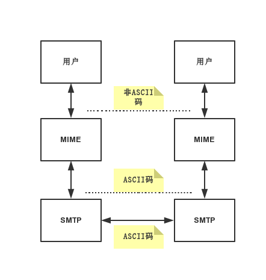

MIME协议
========
英文全称：**Multipurpose Internet Mail Extensions** 
中文称作：通用因特网邮件扩充
##概述
>百度百科  
它设计的最初目的是为了在发送电子邮件时附加多媒体数据，让邮件客户程序能根据其类型进行处理。
然而当它被HTTP协议支持之后，它的意义就更为显著了。它使得HTTP传输的不仅是普通的文本，而变得丰富多彩。

由此可知MIME最初是一种电子邮件协议，那么和其他的电子邮件协议有什么不同呢？
###与SMTP对比
SMTP有如下缺点：
* SMTP不能传送可执行文件或其他二进制对象
* SMTP仅限于传送7位的ASCII码
* SMTP服务器会拒绝超过一定长度的邮件
* 某些SMTP的实现并未完全按照SMTP因特网标准，常见问题：
  * 回车、换行的删除和增加
  * 超过76个字符时的处理：截断或自动换行
  * 后面多余空格的删除
  * 将制表符Tab转换位若干个空格

于是MIME应运而生。但是MIME并未改动或取代SMTP。MIME在继续使用`RFC 822`的基础上，增加了邮件主体结构，并定义了传送费ASCII码的编码规则。

-------------
参考资料：  
《计算机网络》（第5版）谢希仁