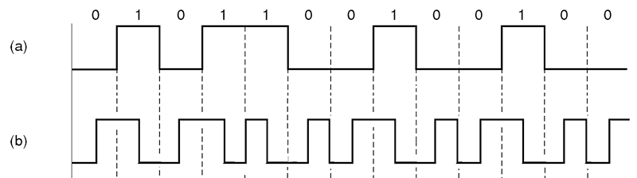

CSMA/CD协议
=====
>因为文件命名不能出现 / ，所以文件名用CSMA-CD.md代替

CSMA/CD是**载波监听多点接入/碰撞检测**的缩写
##工作原理
* 【发前先侦听】发送前先监听信道是否空闲，
* 【空闲即发送】若空闲则立即发送数据
* 【边发边检测】在发送时，边发送边继续监听
* 【冲突时退避】若监听到冲突，则立即停止发送。等待一端随机事件以后，再重新尝试

###曼彻斯特编码

图中的(b)就是曼彻斯特编码，它以电平的变化来表示0,1，而不是以电平的高低来表示。