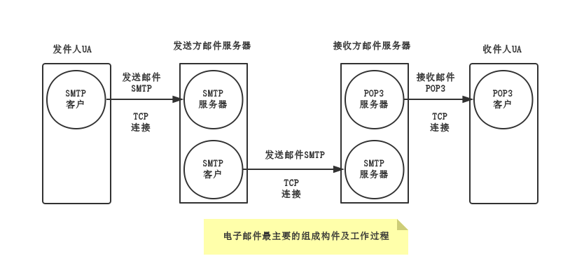
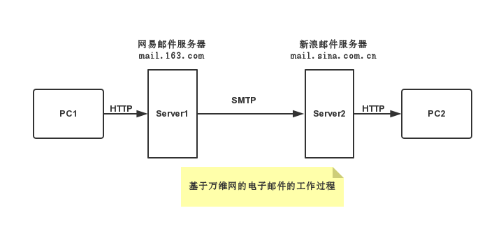

电子邮件
==========
##邮件格式：
	收件人邮箱名@邮箱所在主机的域名
	
常用的电子邮件协议有SMTP、POP3、IMAP、[MIME](MIME.md)。
>MIME本为因特网邮件扩充协议，后来被HTTP协议支持，就不单是邮件协议了。
  
##电子邮件基本工程过程

##SMTP
简单邮件传送协议

用于发送邮件
##POP3
邮局协议3
>用于接收邮件

POP3协议的特点是只要用户从POP服务器读取了邮件，POP服务器就把该邮件删除。
##IMAP
网际报文存取协议
>用于接收邮件

IMAP最大的好处就是用户可以再不同的地方使用不同的计算机随时上网阅读和处理自己的邮件。  
IMAP的缺点是如果用户没有将邮件复制到奥PC机上，则邮件一直是存放在IMAP服务器上。因此，用户要经常与IMAIP服务器建立连接。

>强调！无论是是发件人的用户代理想发送方邮件服务器发送邮件，还是发送方邮件服务器向接收方邮件服务器发送邮件，都是使用**SMTP**协议。  
而**POP**和**IMAP**则是用户代理从接收方服务器上读取邮件所使用的协议。

###基于万维网的电子邮件工作过程
