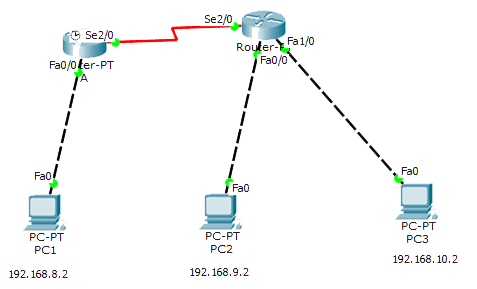

访问控制列表ACL配置实验
===========
##拓扑图

##配置命令
搭建实验环境，我使用三个网段（192.168.8.0 /192.168.9.0 /192.168.10.0） 内主机能够互相连通
```
路由器A
>ena
#conf t
(config)int s2/0
(config-if)ip address 10.1.1.1 255.255.255.0
(config-if)no shutdown
(config-if)int f0/0
(config-if)ip address 192.168.8.1 255.255.255.0
(config-if)no shutdown
(config-if)router rip
(config-if)version 2
(config-if)net 10.1.1.0
(config-if)net 192.168.8.0
(config-if)end
切换到路由器B
>ena
#conf t
(config)int s0/2/0
(config-if)ip address 10.1.1.2 255.255.255.0
(config-if)no shutdown
(config-if)int f0/0
(config-if)ip address 192.168.9.1 255.255.255.0
(config-if)no shutdown
(config-if)int f0/1
(config-if)ip address 192.168.10.1 255.255.255.0
(config-if)no shutdown
(config-if)router rip
(config-if)version 2
(config-if)net 10.1.1.0
(config-if)net 192.168.9.0
(config-if)net 192.168.10.0
(config-if)end
配置标准访问控制列表
A(config-if)Access-list 15 deny 192.168.9.0 0.0.0.255
A(config-if)Access-list 15 permit any
A(config-if)interface s2/0
A(config-if)ip access-group 15 in

配置扩展访问控制列表
(config)no access-list 15 取消标准控制列表15
(config)end

(config)#ip access-list extended 105
(config-ext-nacl)#deny ip 192.168.9.0 0.0.0.255 host 192.168.8.2  
(config-ext-nacl)#permit ip any any
(config-ext-nacl)#int s2/0
(config-if)#ip access-group 105 in
(config-if)#end
```