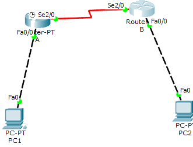

路由器和交换机上配置DHCP
==============
##拓扑图

##配置命令
```
路由器A配置
en
config t
int f0/0
ip address 192.168.10.1 255.255.255.0
no shut
int s2/0
ip address 12.1.1.1 255.255.255.0
clock rate 64000
no shut
exit
ip route 192.168.11.0 255.255.255.0 255.255.255.0 12.1.1.2

路由器B的配置
en
config t
int f0/0
ip address 192.168.11.1 255.255.255.0
no shut
int s2/0
ip address 12.1.1.2 255.255.255.0
no shut
exit
ip route 192.168.10.0 255.255.255.0 12.1.1.1 

路由器A配置
ip dhcp pool zhulou  //配置主楼DHCP地址池
network 192.168.10.0 255.255.255.0  //动态分配192.168.10.0/24这个网段内的IP地址
dns-server 218.2.135.1   //为主楼计算机配置DNS服务器
default-router 192.168.10.1   //为主楼的客户机配置网关
ip dhcp pool fulou   //配置辅楼DHCP地址池
network 192.168.11.0 255.255.255.0    //动态分配192.168.11.0/24这个网段内的IP地址
dns-server 218.2.135.1    //为辅楼计算机配置DNS服务器
default-router 192.168.11.1   //为辅楼的客户机配置网关
exit
ip dhcp excluded-address 192.168.10.1  //排除主楼客户机的网关
ip dhcp excluded-address 192.168.11.1   //排除辅楼客户机的网关

路由器B配置（配置DHCP中继）

int f0/0
ip helper-address 12.1.1.1  //配置辅助寻址，指向DHCP服务器的地址，即路由器R1的IP地址
```