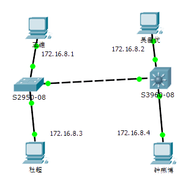

虚拟局域网（VLAN）综合实验
=============
##拓扑图

##配置命令
```
① 配置trunk。
登录到交换机3560
S3560-08(config)# interface fa0/2
S3560-08(config-if)# switchport trunk encapsulation dot1q
S3560-08(config-if)# switchport mode trunk

登录到交换机2950
S2950-08(config)# interface fa0/6
S2950-08(config-if)# switchport mode trunk
注意：Cisco 2950不支持switchport trunk encapsulation dot1q 命令，dot1q 为2950 的默认trunk封装。

② 在3560和2950上设置VTP 参数
将3560 配置为VTP server，将2950配置为VTPclient。
登录到交换机3560
S3560-08# vlan database
S3560-08(vlan)# vtp domain ncdx
S3560-08(vlan)# vtp password cisco
S3560-08(vlan)# vtp server
S3560-08(vlan)# exit

登录到交换机2950
S2950-08# vlan database
S2950-08(vlan)# vtp domain ncdx
S2950-08(vlan)# vtp password cisco
S2950-08(vlan)# vtp client
S2950-08(vlan)# exit

③ 在Server交换机3560上创建VLAN。
登录到交换机3560
S3560-08# vlan database
S3560-08(vlan)# vlan 2 name W1
S3560-08(vlan)# vlan 3 name W2
S3560-08(vlan)# exit

④  将3560的fa0/7、 2950的fa0/7加入VLAN 2
将3560的fa0/8、 2950的fa0/8加入VLAN 3。
登录到交换机3560
S3560-08(config)# interface fa0/7
S3560-08(config-if)# switchport mode access
S3560-08(config-if)# switchport access vlan 2
S3560-08(config-if)# exit
S3560-08(config)# interface fa0/8
S3560-08(config-if)# switchport mode access
S3560-08(config-if)# switchport access vlan 3
S3560-08 config-if)# exit

登录到交换机2950
S2950-08(config)# interface fa0/7
S2950-08(config-if)# switchport mode access
S2950-08(config-if)# switchport access vlan 2
S2950-08(config-if)# exit 
S2950-08(config)# interface fa0/8
S2950-08(config-if)# switchport mode access
S2950-08(config-if)# switchport access vlan 3
S2950-08(config-if)# exit

```